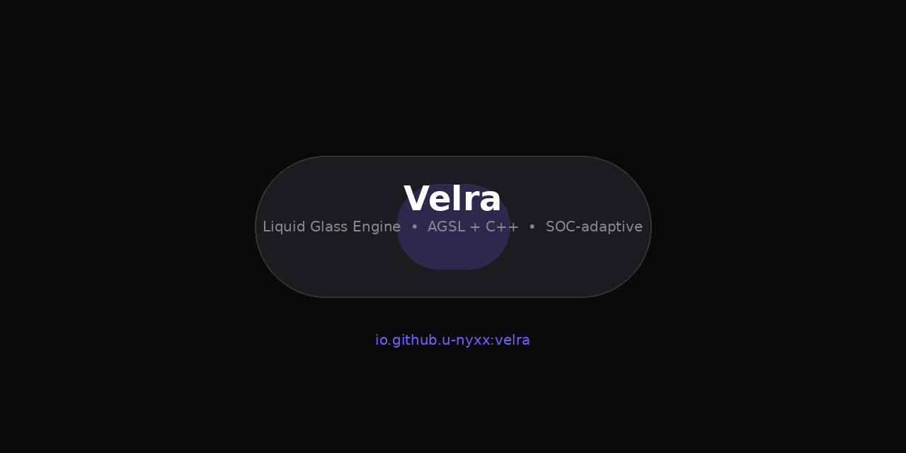

# Klynt

LSPosed module that replaces the bottom bar in Telegram and Twitter/X with a floating glass pill.

<p>
  <a href="https://github.com/U-Nyxx/Klynt/releases/latest"></a>
  <a href="https://github.com/U-Nyxx/Klynt/actions/workflows/release.yml"></a>
  <a href="https://github.com/U-Nyxx/velra"></a>
  <a href="LICENSE"></a>
  
  
</p>



> **Rebuild, not a theme.** The bar is `AGSL + RenderEffect` on the GPU and `C++` on the CPU for thermal/SOC checks. Spring is `Choreographer` `170/0.72`, not `ValueAnimator`. No network hooks.

| | | |
|---|---|---|
|  | **Pill `68×56`** inside `#1C1B20 @0.82` scrim, `1dp` border, top specular. Blur `18` elite / `12` mid / `8` low. `FULL` 4 taps (3 CA), `LITE` 2 taps. | **Ghost fallback** — `KlyntGhostBar` draws when `debug.hwui.disable_blur` kills HWUI. `INVISIBLE` not `GONE`, `findCover` guard `25% / 60% / 3×`. |

### Install

1. **Download** `klynt-<ver>-<code>.apk` from [Releases](https://github.com/U-Nyxx/Klynt/releases/latest) — codename rotates, e.g. `klynt-1.0.11-Bv8Q.apk`
2. Install
3. **LSPosed → Modules → Klynt → tick** Telegram / X (or *Aktifkan scope* in app)
4. Force-stop target → open again → pill appears

Requires `arm64` + `Android 13+` (AGSL needs 33) + `LSPosed 101+` (single build runs on 101/102). Older stays on `v1.0.7`.

### Stack

```
Kotlin 2.2.10  +  C++ NDK 27  +  AGSL RuntimeShader
Compose BOM 2024.08  ·  OkHttp 4.12  ·  libxposed 101
Gradle 9.3.1 / CMake 3.22 / JDK 17 — compileSdk 37 / target 35 / min 33
```

- `GlassMotion` spring, `KlyntGlassView` `RenderEffect` chain `blur → AGSL`, `klynt_hook.cpp` `__system_property_get` — `Kotlin` orchestrates, `AGSL` shades, `C++` talks to HAL. Not full Kotlin.
- Engine is [Velra](https://github.com/U-Nyxx/velra) `io.github.u-nyxx:velra` — same `VELRA_GLASS_SHADER` + `SocDetector` as a library.

### How it finds the bar

- **Ghost first** — role `clickable + labeled + bottom 12% + 3 siblings`, `Tap → performClick()`
- **Wrapper second** — `BottomNavigationView → semantics (wide 0.85 + 3 labels) → size 48..80dp`
- `DISARM` on toggle off, `reconfigure` live, `WeakHashMap` + `1500ms` throttle, `4000` node budget
- SOC: `SocDetector.profileFor(sm8/sun/mt8/mt6/s5e/gs)` → `FULL/LITE/SCRIM` → `ThermalListener` live downgrade `MODERATE+ → SCRIM`

Full map: [`docs/ARCHITECTURE.md`](docs/ARCHITECTURE.md) · [`docs/HOOKS.md`](docs/HOOKS.md) · [`docs/SOC_TIERS.md`](docs/SOC_TIERS.md)

### Build

```bash
git clone https://github.com/U-Nyxx/Klynt.git && cd Klynt
./gradlew assembleDebug          # 52M debug
./gradlew testDebugUnitTest      # SocDetector + GlassTier + ReleaseInfo + GlassMotion
python3 tools/verify_apk.py app/build/outputs/apk/debug/app-debug.apk  # scope 27 ↔ queries
# release (CI): APP_SIGN_KEY/PWD/ALIAS → ./gradlew assembleRelease
```

### Apps

**Telegram** Official, Beta, Web, Plus, Nekogram, NekoX, Nagram/X, Cherrygram, Forkgram, Turrit, Octogram, Mercurygram, Nullgram, iMe, exteraGram, Telega, Yukigram, Nicegram, TGConnect
**Twitter/X** `com.twitter.android`

> `scope.list` 27 ↔ `<queries>` 27 — `verify_apk.py` fails if `nekox.messenger` drifts.

### Docs

[Research](docs/RESEARCH.md) · [Glass Engine](docs/GLASS_ENGINE.md) · [Limitations](docs/LIMITATIONS.md) · [Changelog](CHANGELOG.md) · [Contributing](CONTRIBUTING.md)

FAQ: *Module not showing* → LSPosed 101+ · *Glass not showing* → checklist + force-stop · *Play Protect* → Install anyway

### License

MIT — see [LICENSE](LICENSE) — platform-agnostic, no trademark issues.
