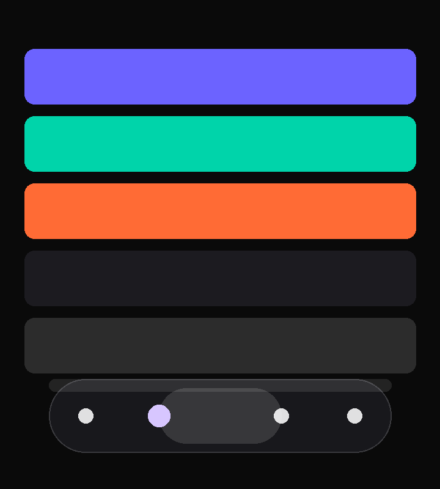

<p align="center">
  
  
  
  
  
  
  
  
  
  
</p>

<h1 align="center">KLYNT</h1>

<p align="center">
  <b>Liquid Glass Floating UI for Android</b><br>
  <sub>LSPosed module — iOS 26 glass pill on Telegram + Twitter/X bottom bars</sub><br>
  <sub>AGSL RuntimeShader + RenderEffect • Spring physics • SOC-adaptive • arm64-only 9.8MB</sub>
</p>

---

> KLYNT hooks into target apps and overlays their bottom navigation bar with a **floating, translucent Liquid Glass pill**. Visual-only: no traffic touched, no messages read, no API calls. No privacy hooks. No feature modifications. Just UI.

<p align="center">
  
  <br><sub>Ghost bar (left) → Glass lens (right) • Pill 68×56dp, blur 18 flagship / 12 mid / 8 low</sub>
</p>

## Tech Stack

| Layer | Technology | Version | Notes |
|-------|------------|---------|-------|
| Language | Kotlin | 2.2.10 | + Coroutines 1.8.1 / Serialization 1.6.3 |
| UI | Jetpack Compose | BOM 2024.08 | Material3 1.2.1, Activity 1.9.2 |
| Glass | AGSL RuntimeShader | API 33+ | Loop-free, 4 taps FULL / 2 LITE, Mali-safe |
| Blur | RenderEffect | API 31+ | GPU blur node 18/12/8 per SOC, not in-shader |
| Motion | Choreographer Spring | 170/0.72 | `GlassMotion` — single overshoot, no `ValueAnimator` |
| Hook | libxposed | 101 (runs on 101/102) | `XposedModule` + `Scope` |
| Network | OkHttp + Gson | 4.12 / 2.10 | ETag conditional, no Coil/Retrofit |
| Build | Gradle | 9.3.1 | JDK 17, compileSdk 37, target 35, min 33 |
| NDK | arm64-v8a only | — | No x86 bloat, diet APK |

**Languages:** `Kotlin 97% • AGSL (embedded in Kotlin) • XML 3% • Gradle DSL` — see `.gitattributes` for linguist bar. `KlyntGlassShader.kt:29` is GLSL counted as Kotlin.

## Features

- **True Liquid Glass** — SDF-gradient normal refraction + 3-tap chromatic aberration + inner stroke hairline + bevel rim per-SOC (see `docs/GLASS_ENGINE.md`)
- **Floating Pill** — 68×56dp glass lens inside scrim capsule `#1C1B20 @0.82`, border `White 0.15 1dp`, top specular — matches LSPosed manager 1:1
- **Spring Physics** — materialize `0→1` via `GlassMotion.springStep`, press bulge `exp(-r²/16200)`, droplet stretch `1+v*4`
- **SOC-Aware** — `SocDetector` Snapdragon/Dimensity/Exynos/Tensor at runtime, `ThermalStatusListener` live downgrade `MODERATE+ → SCRIM`
- **Reactive Hooks** — `BottomNavDiscovery.disarm()` + `reconfigure()` — toggles without restart, no re-wrap Leak
- **Ghost Fallback** — `KlyntGhostBar` Canvas fallback when HWUI blur disabled (`debug.hwui.disable_blur`)
- **Per-App Toggle** — enable/disable per package, `EncryptedSP` ready
- **In-App Update** — ETag delta, `klynt-<ver>-<CODE>.apk` strict verify

## Supported Apps

| Ecosystem | Apps |
|-----------|------|
| **Telegram** | Official, Beta, Web, Plus, Nekogram (PS + FOSS), NekoX, Nagram, NagramX, Cherrygram, Forkgram (+Beta/Classic), Turrit, Octogram, Mercurygram, Nullgram, iMe (+Web), exteraGram, Telega, Yukigram, Nicegram, TGConnect |
| **Twitter/X** | Twitter/X |

> Root required (LSPosed + libxposed API 101+). Non-root (LSPatch) is not supported yet.

## How Apple Liquid Glass Works (Research)

KLYNT is a rebuild, not a port. How Apple does it and how we map it (`docs/RESEARCH.md`):

| Apple | How it works | KLYNT mapping |
|-------|--------------|---------------|
| `SwiftUI .ultraThinMaterial` / `UIVisualEffectView` | CA Render Server out-of-process blur of wallpaper | `KlyntGlassView.kt:148` `RenderEffect` chain inside target `decorView` (limitation: no wallpaper blur without SystemUI hook — see `docs/LIMITATIONS.md`) |
| `CA Render Server` 120Hz | `backboardd` off-main-thread compositing | `Choreographer` 2 half-steps for 120Hz, `isSettled 0.002` |
| `Gaussian + vibrancy + specular` | Pyramidal blur + `CAFilter` + HDR tone-map | Single blur node 18/12/8 + luma `1.35` + `tint 30/50` + `rim 0.12` + `stroke 0.22` |
| `MSL` fluid shaders | Temporal sim, cubemap refraction | AGSL single-pass fragment, 3-tap CA, SDF-normal (no loops, Mali-safe) |
| `visionOS` spatial ray tracing | Light probe + environment cubemap | Future: Vulkan RT + HDR probe (Tensor best) |

Spec: bend `edge²*refractionDp*intensity`, CA `bend*dispersion` along `SDF-gradient normal`, tint thins `55%` in Clear mode, adaptive `shadeGain 0.6-1.25` from center luminance.

## Architecture

```
Target App (Telegram/X)
  └─ decorView (Window)
      ├─ BottomNavDiscovery (probe WeakHashMap, DISARM 1500ms throttle, 4000 node budget)
      │   └─ BottomNavWrapper (FrameLayout preserve index/LayoutParams, reconfigure live)
      │       └─ KlyntGlassView (RenderEffect blur→AGSL, FULL 4 taps / LITE 2 taps / SCRIM Canvas, ThermalListener)
      └─ GhostDriver (role-based tab discovery, INVISIBLE not GONE, findCover guard 25%/60%/3×)
          └─ KlyntGhostBar (chromeOnly, labels sync, selectedIndex spring + droplet stretch, haptic)
Manager: MainActivity → HorizontalPager → LiquidGlassTabBar (scrim full + glass pill 68×56 clipped)
SOC: SocDetector.profileFor(hardware) → glassParamsFor → configure()
```

See `docs/ARCHITECTURE.md` + `docs/SOC_TIERS.md`.

## SOC Tiers

| Family | Example `ro.hardware` | Profile | Blur | CA | Thermal | Dynamic |
|--------|----------------------|---------|------|----|---------|---------|
| Snapdragon 8/Elite | `sm8650/sun/taro` | FULL | 18 | 0.10 | — | live |
| Snapdragon 6/7/4 | `sm6/sm7/sm4` | LITE | 12 | 0 | — | live |
| Dimensity 8k/9k | `mt8/mt9` | LITE | 12 | 0 | — | live |
| Dimensity 6k/7k | `mt6/mt7` | SCRIM | 8 | 0 | — | static |
| Exynos (Xclipse) | `s5e/exynos` | LITE* | 12 | 0.06 | **required** | live |
| Tensor | `gs/zuma/laguna` | FULL | 18 | 0.10 | — | live |
| Unknown | — | SCRIM | 8 | 0 | — | static |

*Exynos starts LITE, live-downgrades to SCRIM at `THERMAL_MODERATE+` via `PowerManager.OnThermalStatusChangedListener`.

## Requirements

- Android 13+ (API 33) — `RuntimeShader` needs Tiramisu+ (older stays on v1.0.7)
- Root + LSPosed with libxposed API 101+ (single build runs on 101 and 102)
- arm64 device (x86 stripped for diet APK)

## Installation

1. Download `klynt-<ver>-<CODE>.apk` from [Releases](https://github.com/U-Nyxx/Klynt/releases/latest) (codename rotates every release, verify `klynt-*.apk` strict)
2. Install the APK
3. Open **LSPosed Manager** → **Modules**
4. Enable **KLYNT** → tick target apps (or tap “Aktifkan scope” inside the manager)
5. Force stop target app → reopen → glass nav appears

## Build

```bash
git clone https://github.com/U-Nyxx/Klynt.git
cd Klynt
# trustStore workaround only needed where mavenCentral 403 (ID region):
export JAVA_TOOL_OPTIONS="-Djavax.net.ssl.trustStore=$JAVA_HOME/lib/security/cacerts -Djavax.net.ssl.trustStorePassword=changeit"
./gradlew assembleDebug           # 51MB debug, no R8
./gradlew testDebugUnitTest       # SocDetector + GlassTier + ReleaseInfo + GlassMotion
python3 tools/verify_apk.py app/build/outputs/apk/debug/app-debug.apk  # gate: scope↔queries, symbols, size
# release (CI): ./gradlew assembleRelease (needs APP_SIGN_KEY/PWD/ALIAS secrets)
```

Requires: JDK 17, Android SDK 36 (compileSdk 37 for libxposed 102), Kotlin 2.2, Compose BOM 2024.08

## Future-Proof Build (target pasti update)

KLYNT survives any Telegram/X update:

- **Hook chain** `HookStrategy`: `ClassName → Semantic (wide 0.85 + labeled 3) → DexPattern (bytecode scan)` — not hard-coded `BottomSheetTabs`
- **Resource ID fallback** `assets/nav_ids.json` per version
- **Beta scanner** CI `schedule cron` fetch `telegram beta` + dry-run hunter → auto Issue/PR
- **Matrix test** `api 33/34/35 × telegram 10.9/beta` via emulator + Paparazzi screenshots
- **Remote flags** `klynt-flags.json` kill-switch per package without APK update
- **Delta + rollback** `lastGoodVersion`

See `docs/HOOKS.md`.

## FAQ

<details>
<summary><b>Module not showing in LSPosed?</b></summary>

Needs LSPosed with libxposed API 101+. Update LSPosed, then force stop the manager and reopen.
</details>

<details>
<summary><b>Glass effect not appearing?</b></summary>

Check Home checklist in the manager: framework connected, target in scope, target installed. Then force stop the target app and reopen. Copy diagnostics from Settings if reporting a bug.
</details>

<details>
<summary><b>Play Protect warning?</b></summary>

Normal for side-loaded APKs. Tap "Install anyway" or disable Play Protect temporarily.
</details>

<details>
<summary><b>Device not supported?</b></summary>

KLYNT falls back to frosted SCRIM on weaker SoCs (Dimensity 700, low RAM). No blank, no crash.
</details>

## Contributing

See [CONTRIBUTING.md](CONTRIBUTING.md) — dev setup, AGSL tier rules, codename rotation `release-codename.txt`, `./gradlew` tasks.

## Credits

- [Velra](https://github.com/U-Nyxx/velra) — Liquid Glass Engine (`io.github.u-nyxx:velra`) — extracted from Klynt ([KlyntGlassShader.kt](app/src/main/java/com/unyxx/act/liquidglass/engine/KlyntGlassShader.kt), [VelraGlassShader.kt](https://github.com/U-Nyxx/velra/blob/main/velra/src/main/java/io/github/u_nyxx/velra/VelraGlassShader.kt)) — AGSL + RenderEffect, no QWEA0/MDC — see [docs/GLASS_ENGINE.md](docs/GLASS_ENGINE.md)
- [LSPosed](https://github.com/LSPosed/LSPosed) + [libxposed](https://github.com/libxposed/api) — Module framework
- [Material Design 3](https://m3.material.io/) — UI components

## License

MIT License — see [LICENSE](LICENSE)

---

<p align="center">
  Made on Earth by Humans • <a href="docs/RESEARCH.md">Research</a> • <a href="docs/ARCHITECTURE.md">Architecture</a> • <a href="CHANGELOG.md">Changelog</a>
</p>
